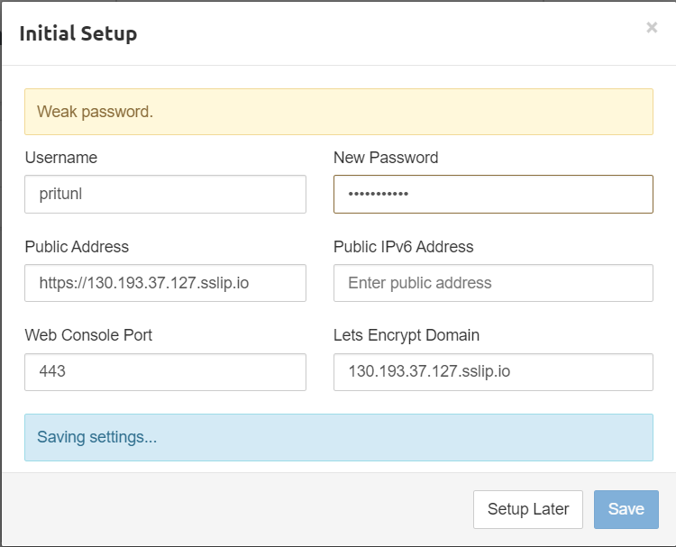

<?xml version="1.0" encoding="UTF-8"?>
<module type="JAVA_MODULE" version="4" />

#vlyulin Infra repository

Commit to main: 

Pull request: 

#Content:
* [Student](#Student)
* [Module hw03-bastion](#Module-hw03-bastion)
* [Module hw04-cloud-testapp](#Module-hw04-cloud-testapp)
* [Module hw05-packer](#Module-hw05-packer)
* [Module hw06-terraform-1](#Module-hw06-terraform-1)
* [Module hw07-terraform-2](#Module-hw07-terraform-2)
* [Module hw08-ansible-1](#Module-hw08-ansible-1)
* [Module hw09-ansible-2](#Module-hw09-ansible-2)
* [Module hw10-ansible-3](#Module-hw10-ansible-3)


# Student
`
Student: Vadim Lyulin
Course: DevOps
Group: Otus-DevOps-2021-08
`

## Module hw03-bastion "Запуск VM в Yandex Cloud,  управление правилами фаервола, настройка SSH подключения, настройка SSH подключения через Bastion Host, настройка VPN сервера и VPN-подключения" <a name="Module-hw03-bastion"></a>
> Цель:
> В данном дз студент создаст виртуальные машины в YC. Настроит bastion host и ssh.
> В данном задании тренируются навыки: создания виртуальных машин, настройки bastion host, ssh
> Все действия описаны в методическом указании.

### Самостоятельное задание
Исследовать способ подключения к someinternalhost в одну команду из вашего рабочего устройства,
проверить работоспособность найденного решения и внести его в README.md в вашем репозитории.

#### Решение
Использовать ключ -J (ssh jump host) для перепрыгивания через hosts.
Команда:
```
ssh -i ~/.ssh/vlyulin_key -J appuser@130.193.38.153 appuser@10.128.0.30
```

### Дополнительное задание:
Предложить вариант решения для подключения из консоли при помощикоманды вида ssh someinternalhost из локальной консоли рабочегоустройства,
чтобы подключение выполнялось по алиасуsomeinternalhost и внести его в README.md в вашем репозитории.

#### Решение
Настроить Static jumphost list.
Для этого сощдается файл ~/.ssh/config, где указываются переходы
```
### Первый переход к host, который доступен напрямую.
Host bastion
  User appuser
  HostName 130.193.38.153

### Host для последующего перехода
Host someinternalhost
  User appuser
  HostName 10.128.0.30
  ProxyJump bastion
```

Выполнить команду:
```
ssh -i ~/.ssh/vlyulin_key someinternalhost
```
### Дополнительное задание
С помощью сервисов / и реализуйте
использование валидного сертификата для панели управления VPN-сервера

#### Решение



https://130.193.37.127.sslip.io

## Описание конфигурации
bastion_IP = 130.193.37.12
someinternalhost_IP = 10.128.0.30

## Module hw04-cloud-testapp "Практика управления ресурсами yandex cloud через YC" <a name="Module-hw04-cloud-testapp"></a>
> Цель:
> В данном дз произведет ручной деплой тестового приложения. Напишет bash скрипт для автоматизации задач настройки VM и деплоя приложения.
> В данном задании тренируются навыки: деплоя приложения на сервер, написания bash скриптов.
> Ручной деплой тестового приложения. Написание bash скриптов для автоматизации задач настройки VM и деплоя приложения.
> Все действия описаны в методическом указании.

Деплой тестового приложения reddit

1) Установлен YC CLI
2) Создана ВМ
2) Созданы скрипты для установки:
        - Ruby и Bundler (install_ruby.sh),
        - MongoDB (install_mongo.sh),
        - Reddit (deploy.sh)
3) Скриптам install_ruby.sh, install_mongo.sh, deploy.sh установлен флаг исполнения +x
4) Проверена работа приложения http://62.84.116.223:9292
5) Предпринята попытка выполнения дополнительного задания

testapp_IP=62.84.116.223
testapp_port=9292

Создание ключей:
```
ssh-keygen -t rsa -b 2048 -f ~/.ssh/appuser -C appuser -P ""
```

Команда создания ВМ (файл yc-create-instance.sh):
```
#!/bin/bash
yc compute instance create \
  --name reddit-app \
  --hostname reddit-app \
  --memory=4 \
  --create-boot-disk image-folder-id=standard-images,image-family=ubuntu-1604-lts,size=10GB \
  --network-interface subnet-name=default-ru-central1-a,nat-ip-version=ipv4 \
  --metadata serial-port-enable=1 \
  --ssh-key ~/.ssh/appuser.pub
```

Соединение с rabbit-app:
ssh -i ~/.ssh/appuser yc-user@62.84.116.223

Дополнительное задание:
`
В качестве доп. задания используйте созданные ранее скрипты длясоздания,
который будет запускаться при создании инстанса.В результате применения данной команды CLI
мы должны получать инстанс с уже запущенным приложением. Startup скрипт
необходимо закомитить, а используемую команду CLI добавить в описание репозитория(README.md)
`

Конфигурационный файл (cloud-config.yml):
```
#cloud-config

users:
  - name: appuser
    groups: sudo
    shell: /bin/bash
    sudo: ALL=(ALL:ALL) NOPASSWD:ALL
    ssh_authorized_keys:
      - ssh-rsa AAAAB3NzaC1yc2EAAAADAQABAAABAQCjk1hL2RJ/cLvzmBZ4dsRGKmceEh+x5VxMPY09/wG/yiv7j2gm+flQQ4bRZfQwmEPsVW8OflQPBfyVsttXoilG0Q5xO2hT1Kgjr/RMGW6LghXOZFSTFLEZ+OAXgf89W3RyYIMgsJti7qNTHJSqsq1CrxNm8fCVdU1h//+YOoYQUgEZ25uOHPm/agByptI4Icqv/0u5pYpu2IJHo4ko/D3uVwsc9WRPyFt73uPW/EGgOCjVWTvNxuGxb6S7f1KMHuKrf4vrjeuO7YfklCldnjhnULLj0SV1LhdmRzkNNAU8WZdw/HCyRKpUmY5aM6UlkayI0x+plFMQE4ODj7yQaJ0r appuser

bootcmd:
  # install ruby
  - sudo apt update
  - sudo apt install -y ruby-full ruby-bundler build-essential
  # install mongo
  - wget -qO - https://www.mongodb.org/static/pgp/server-4.2.asc | sudo apt-key add -
  - echo "deb [ arch=amd64,arm64 ] https://repo.mongodb.org/apt/ubuntu xenial/mongodb-org/4.2 multiverse" | sudo tee /etc/apt/sources.list.d/mongodb-org-4.2.list
  - sudo apt-get update
  - sudo apt-get install -y mongodb-org
  - sudo systemctl start mongod
  - sudo systemctl enable mongod
  # install reddit
  - cd ~
  - apt install git
  - git clone -b monolith https://github.com/express42/reddit.git
  - cd reddit && bundle install
  - puma -d
```

Другой вариант конфигаруционного файла cloud-config_sudoers.d.yml:
```
#cloud-config

bootcmd:
  - echo "======Put public key to authorized_keys======"
  - PUBKEY="ssh-rsa AAAAB3NzaC1yc2EAAAADAQABAAABAQCjk1hL2RJ/cLvzmBZ4dsRGKmceEh+x5VxMPY09/wG/yiv7j2gm+flQQ4bRZfQwmEPsVW8OflQPBfyVsttXoilG0Q5xO2hT1Kgjr/RMGW6LghXOZFSTFLEZ+OAXgf89W3RyYIMgsJti7qNTHJSqsq1CrxNm8fCVdU1h//+YOoYQUgEZ25uOHPm/agByptI4Icqv/0u5pYpu2IJHo4ko/D3uVwsc9WRPyFt73uPW/EGgOCjVWTvNxuGxb6S7f1KMHuKrf4vrjeuO7YfklCldnjhnULLj0SV1LhdmRzkNNAU8WZdw/HCyRKpUmY5aM6UlkayI0x+plFMQE4ODj7yQaJ0r appuser"
  - sudo echo $PUBKEY > ~/.ssh/authorized_keys
  - echo "======Create user======"
  - USERNAME="appuser"
  - adduser --disabled-password --gecos "" $USERNAME
  - echo "$USERNAME ALL=(ALL:ALL) NOPASSWD: ALL" | sudo tee /etc/sudoers.d/$USERNAM
  - echo "install ruby"
  - sudo apt update
  - sudo apt install -y ruby-full ruby-bundler build-essential
  - echo "install mongo"
  - wget -qO - https://www.mongodb.org/static/pgp/server-4.2.asc | sudo apt-key add -
  - echo "deb [ arch=amd64,arm64 ] https://repo.mongodb.org/apt/ubuntu xenial/mongodb-org/4.2 multiverse" | sudo tee /etc/apt/sources.list.d/mongodb-org-4.2.list
  - sudo apt-get update
  - sudo apt-get install -y mongodb-org
  - sudo systemctl start mongod
  - sudo systemctl enable mongod
  - echo "install reddit"
  - cd ~
  - apt install git
  - git clone -b monolith https://github.com/express42/reddit.git
  - cd reddit && bundle install
  - puma -d
```

Команда создания ВМ (файл yc-create-instance-with-cloud-config.sh):
```
#!/bin/bash
yc compute instance create \
  --name reddit-app2 \
  --hostname reddit-app2 \
  --memory=4 \
  --create-boot-disk image-folder-id=standard-images,image-family=ubuntu-1604-lts,size=10GB \
  --network-interface subnet-name=default-ru-central1-a,nat-ip-version=ipv4 \
  --metadata serial-port-enable=1 \
  --metadata-from-file user-data=cloud-config.yml

```

Передать файлы в git как выполняемые (+x):
```
git update-index --chmod=+x
```

## Module hw05-packer: Подготовка образов с помощью packer <a name="Module-hw05-packer"></a>
> Цель:
> В данном дз студент произведет сборку готового образа с уже установленным приложением при помощи Packer.
> Задеплоит приложение в Yandex compute cloud при помощи ранее подготовленного образа.
> В данном задании тренируются навыки: работы с Packer, работы с YC.
> Все действия описаны в методическом указании.

Выполненные работы

1. Создана ветка packer-base
2. Наработки с предыдущего ДЗ перенесены в директорию config-scripts
3. Установлена и проверена установка программы packer (https://www.packer.io/downloads)
4. Создан сервисный аккаунт.
   Для этого:

    4.1 Получен folder-id - ID каталога в Yandex.Cloud:
    ```
    yc config list
    ```

    4.2 Создан сервисный аккаунт (скрипт create_service_account.sh)
    ```
    #!/bin/bash
    SVC_ACCT=vl71
    FOLDER_ID=b1g97nk43unle0o4u325
    yc iam service-account create --name $SVC_ACCT --folder-id $FOLDER_ID
    ```

    4.3 Созданному сервисному аккаунту vl71 даны права editor (скрипт grant_rights.sh)
    ```
    #!/bin/bash
    SVC_ACCT=vl71
    FOLDER_ID=b1g97nk43unle0o4u325
    ACCT_ID=$(yc iam service-account get $SVC_ACCT |  grep ^id | awk '{print $2}')
    yc resource-manager folder add-access-binding --id $FOLDER_ID --role editor --service-account-id $ACCT_ID
    ```

5. Создан IAM ключ
```
yc iam key create --service-account-id $ACCT_ID --output /home/appuser/key.json
```

6. Создана директория packer. В директории parker создан Parker шаблон ubuntu16.json, содержащий описание образа VM.

>**_Note_**: Документация https://cloud.yandex.com/en-ru/docs/solutions/infrastructure-management/packer-quickstart

```
{
    "builders": [
        {
            "type": "yandex",
            "service_account_key_file": "../../key.json",
            "folder_id": "b1g97nk43unle0o4u325",
            "zone":      "ru-central1-a",
            "source_image_family": "ubuntu-1604-lts",
            "subnet_id":           "e9be9todt50r72c98ftm",
            "image_name": "reddit-base-{{timestamp}}",
            "image_family": "reddit-base",
            "ssh_username": "ubuntu",
            "use_ipv4_nat": "true",
            "platform_id": "standard-v1"
        }
    ],
    "provisioners": [
        {
            "type": "shell",
            "script": "scripts/install_ruby.sh",
            "execute_command": "sudo {{.Path}}"
        },
        {
            "type": "shell",
            "script": "scripts/install_mongodb.sh",
            "execute_command": "sudo {{.Path}}"
        }
    ]
}
```
При этом в последствии была решена проблема:
```
==> yandex: Error creating network: server-request-id = 27eebca8-706f-4212-b2a1-a7948ac8f242 server-trace-id = e5114d186ea652c1:e5196846675842d1:e5114d186ea65
2c1:1 client-request-id = e1f3eb34-35cb-46f1-a0a7-daef57aa620d client-trace-id = c5146722-e94d-41f0-bfa9-b7b6902ea975 rpc error: code = ResourceExhausted desc
 = Quota limit vpc.networks.count exceeded
Build 'yandex' errored after 2 seconds 240 milliseconds: Error creating network: server-request-id = 27eebca8-706f-4212-b2a1-a7948ac8f242 server-trace-id = e5
114d186ea652c1:e5196846675842d1:e5114d186ea652c1:1 client-request-id = e1f3eb34-35cb-46f1-a0a7-daef57aa620d client-trace-id = c5146722-e94d-41f0-bfa9-b7b6902e
a975 rpc error: code = ResourceExhausted desc = Quota limit vpc.networks.count exceeded
```

<b>Решение:</b>
В template в секцию builders добавлены:
```
    zone": "ru-central1-a",
    "subnet_id": "e9be9todt50r72c98ftm",
    "use_ipv4_nat": "true",
```

>**_NOTE_:** Сделано на основе: https://cloud.yandex.com/en-ru/docs/solutions/infrastructure-management/packer-quickstart

7. В директорию scripts были скопированы скрипты install_ruby.sh и install_mongodb.sh из предыдущего ДЗ.

8. Выполнена проверка шаблона командой
```
packer validate ./ubuntu16.json
```
9. Выполнена сборка образа reddit-base
```
packer build ./ubuntu16.json
```

10. Создана ВМ (скрипт yc-create-instance.sh)
```
#!/bin/bash
yc compute instance create \
  --name reddit-app \
  --hostname reddit-app \
  --memory=4 \
  --create-boot-disk image-folder-id=b1g97nk43unle0o4u325,image-family=reddit-base,size=10GB \
  --network-interface subnet-name=default-ru-central1-a,nat-ip-version=ipv4 \
  --metadata serial-port-enable=1 \
  --ssh-key ~/.ssh/appuser.pub
```

11. Внешний IP адрес созданной ВМ сделан статическим
>**_NOTE_:** документация https://cloud.yandex.com/en-ru/docs/vpc/operations/set-static-ip
```
yc vpc address list
```
Вывод:
```
+----------------------+------+---------------+----------+------+
|          ID          | NAME |    ADDRESS    | RESERVED | USED |
+----------------------+------+---------------+----------+------+
| e9bqjk6mvujdfci9i68l |      | 62.84.117.216 | true     | true |
+----------------------+------+---------------+----------+------+
```
Установить как статический:
```
yc vpc address update --reserved=true e9bqjk6mvujdfci9i68l
```
Вывод:
```
id: e9bqjk6mvujdfci9i68l
folder_id: b1g97nk43unle0o4u325
created_at: "2021-09-25T07:41:43Z"
external_ipv4_address:
  address: 62.84.117.216
  zone_id: ru-central1-a
  requirements: {}
reserved: true
used: true
type: EXTERNAL
ip_version: IPV4
```

12. Установлен reddit
```
ssh -i ~/.ssh/appuser appuser@62.84.117.216
sudo apt-get update
sudo apt-get install -y
gitgit clone -b monolith https://github.com/express42/reddit.git
cd reddit && bundle install
puma -d
```

13. Проверена работоспособность reddit: http://62.84.117.216:9292

### Параметризирование шаблона

14. Созданы файлы с переменными variables.json и variables.json.example

15. На базе ubuntu16.json создан immutable.json
```
{
    "builders": [
        {
            "type": "yandex",
            "service_account_key_file": "{{user `key`}}",
            "folder_id": "{{user `folder_id`}}",
            "zone":      "{{user `zone`}}",
            "source_image_family": "{{user `source_image_family`}}",
            "subnet_id":           "{{user `subnet_id`}}",
            "image_name": "{{user `image_family`}}-{{timestamp}}",
            "image_family": "{{user `image_family`}}",
            "ssh_username": "{{user `ssh_username`}}",
            "use_ipv4_nat": "true",
            "platform_id": "standard-v1"
        }
    ],
    "provisioners": [
        {
            "type": "shell",
            "script": "scripts/install_ruby.sh",
            "execute_command": "sudo {{.Path}}"
        },
        {
            "type": "shell",
            "script": "scripts/install_mongodb.sh",
            "execute_command": "sudo {{.Path}}"
        },
        {
            "type": "file",
            "source": "files/puma.service",
            "destination": "/tmp/puma.service"
        },
        {
            "type": "shell",
            "inline": [
                "sudo mv /tmp/puma.service /etc/systemd/system/puma.service",

                "cd /opt",
                "sudo apt-get install -y git",
                "sudo chmod -R 0777 /opt",
                "git clone -b monolith https://github.com/express42/reddit.git",
                "cd reddit && bundle install",
                "sudo systemctl daemon-reload && sudo systemctl start puma && sudo systemctl enable puma"
            ]
        }
    ]
}
```
где в качестве базового image указан ранее созданный image reddit-base.
Для установки reddit создан скрипт scripts/install_reddit.sh

16. На основе ресурса https://github.com/puma/puma/blob/master/docs/systemd.md в директории files создан файл puma.service

17. Файл puma.service включается в образ с помощью provisioner https://www.packer.io/docs/provisioners/file
Далее уже с помощью provisioner shell при создании image устанавливается из директории /tmp в нужную директорию /etc/systemd/system/

18. Проверка и создание образа reddit-full
```
packer validate -var-file=./variables.json ./immutable.json
packer build -var-file=./variables.json ./immutable.json
```

19. Создан скрипт create-reddit-vm.sh  в  директории config-scripts для создания ВМ из образа reddit-full
```
yc compute instance create --name reddit-full --hostname reddit-full --memory=4 --create-boot-disk image-folder-id=b1g97nk43unle0o4u325,image-family=reddit-full,size=10GB --network-interface subnet-name=default-ru-central1-a,nat-ip-version=ipv4 --metadata serial-port-enable=1 --ssh-key C:\Users\vlulin\.ssh\appuser.pub
```
20. Внешний IP адрес созданной ВМ сделан статическим
```
yc vpc address list
yc vpc address update --reserved=true ...
```
21. Проверена работа приложения в ВМ созданного из образа reddit-full: http://62.84.116.36:9292/

## Module hw06-terraform-1 "Декларативное описание в виде кода инфраструктуры YC, требуемой для запуска тестового приложения, при помощи Terraform." <a name="Module-hw06-terraform-1"></a>
> Цель:
> В данном дз студент опишет всю инфраструктуру в Yandex Cloud при помощи Terraform.
> В данном задании тренируются навыки: создания и описания инфраструктуры при помощи Terraform. Принципы и подходы IaC.
> Все действия описаны в методическом указании.

1. В инфраструктурном репозитории для выполнения данного создана ветка terraform-1
2. Установлен terraform v.0.12.8
3. Создана директория terraform и файл main.tf
4. В .gitignore добавлены шаблоны файлов terrfarom
5. В Yandex Cloud создан сервисный account terraform, которому дана роль editor
6. Создан авторизованный ключ для сервисного аккаунта terraform
```
yc iam key create --service-account-name terraform --output terraform-key.json
```
7. Создан профиль для выполнения команд от имени сервисного аккаунта terraform
```
yc config profile create terraform-profile
```
8. В конфигурации профиля указан авторизованный ключ сервисного аккаунта:
```
yc config set service-account-key key.json
```
9. В файл main.tf добавлено описания провайдера и ресурса.
10. Создана ВМ с помощью команды:
```
terraform apply -auto-approve
```
11. В ответ на ошибку 'the specified number of cores is not available on platform "standard-v1"' сделано следующее:
11.1 Добавлен атрибут platform_id = "standard-v2"
11.2 Установлен атрибут resources.0.cores = 2
11.3 Установлен атрибут resources.0.core_fraction = 5
12. Сгенерированы ключи для пользователя ubuntu
13. Добавлена секция metadata для описания ssh-ключа для пользователя ubuntu в main.tf
14. Выполнено пересоздание ВМ с помощью команд terraform destroy и terraform apply
15. Выполнено успешное присоединение к созданноё ВМ с пользователем ubuntu с помощью команд
```
terraform show | grep nat_ip_address
ssh -i ~/.ssh/ubuntu/ubuntu ubuntu@62.84.117.150
```
16. Создан файл output.tf
17. Получен ip с помощью команд
```
terraform refresh
terraform output
```
18. Создан файл files/puma.service
19. В файл main.tf добавлен provisioner "remote-exec"
20. Создан файл files/deploy.sh
21. В файл main.tf добавлена секция connection для возможности соединения provisioners к ВМ
22. Отмечаем ВМ как ресурс, который требуется пересоздать при следующем применении изменений
```
terraform taint yandex_compute_instance.app
```
23. Применены изменения, т.е. пересоздана ВМ и выполнены provisioners
24. Проверена работоспособность приложения reddit по выведенному external_ip_address_app = 130.193.39.109
25. Создан файл variables.tf для входных переменных для параметризации входных переменных
26. В файле main.tf определение ресурсов сделано через переменные
27. Определены переменные в файле terraform.tfvars
28. Пересоздана ВМ. external_ip_address_app = 130.193.48.249. Проверена работоспособность приложения reddit.

### Самостоятельные задания
29. Определена переменная для приватного ключа private_key_path
30. Определены входные переменные:
```
variable "zones" - тип map, список возможных зон
variable "zone"  - выбранная зона из списка
```
31. Выполнено форматирование файлов main.tf, terraform.tfvars, variables.tf с помощью команды terraform fmt
32. Создан файл terraform.tfvars.example

### Задание **
33. Cоздан файл lb_target_group.tf с описанием target group, которая будет подключена к load balancer.
```
resource "yandex_lb_target_group" "vl-lb-target-group" {
  name      = "vl-target-group"
  folder_id = var.folder_id
  region_id = var.region_id

  target {
    address = yandex_compute_instance.app.network_interface.0.ip_address
      subnet_id = var.subnet_id
  }
}

```

34. Создан файл lb.tf с описанием load balancer
```
resource "yandex_lb_network_load_balancer" "vllb" {
  name = "vl-network-load-balancer"
  type = "external"

  listener {
    name = "vl-listener"
    port = 80
    target_port = 9292

    external_address_spec {
      ip_version = "ipv4"
    }
  }

  attached_target_group {
    target_group_id = yandex_lb_target_group.vl-lb-target-group.id

    healthcheck {
      name = "tcp"
      tcp_options {
        port = 9292
      }
    }
  }
}
```

35. Добавлена переменная lb_network_ip_address в output.tf
```
output "lb_network_ip_address" {
  value = yandex_lb_network_load_balancer.vllb.listener.*.external_address_spec[0].*.address
}
```

36. Созданы target group и load balancer с помощью команд
```
terraform plan
terraform apply -auto-approve
```

37. Создано второе приложение reddit-app2
```
resource "yandex_compute_instance" "app2" {
  name = "reddit-app2"
  ...
}
```

Второе приложение добавлено в target group "vl-lb-target-group"
```
  target {
    address = yandex_compute_instance.app2.network_interface.0.ip_address
      subnet_id = var.subnet_id
  }
```

Внесены изменения в output.tf
```
output "external_ip_addresses_app" {
  value = yandex_compute_instance.app[*].network_interface.0.nat_ip_address
}
```

38. Проверена работоспособность запросов к приложению через load balancer при остановке одного из приложений (команда 'systemctl stop puma')

39. Ответ на вопрос "Какие проблемы вы видите в такой конфигурации приложения?"
При выполненном вышеописанном подходе при необходимости добавления дополнительной ноды,
требуется копирование описания настроек resource "yandex_compute_instance"
и правка описания target group. Что не есть хорошо, так как требуется копирование кода.

40. Реализован подход с заданием количества инстансов через параметр ресурса count.
В файл variables.tf добавлено описание переменной количество требуемых инстансов.
Удалены настройки второго приложения app2.
Внесены изменения в настройки приложения app учитывающие количество создаваемых инстансов.
```
resource "yandex_compute_instance" "app" {
  iter        = var.required_number_instances
  name        = "reddit-app-${iter.index}"
  platform_id = "standard-v2"
```

Изменено описание target group, чтобы приложения включались в группу динамически
```
dynamic "target" {
    for_each = yandex_compute_instance.app.*.network_interface.0.ip_address
    content {
      subnet_id = var.subnet_id
      address   = target.value
    }
  }
```

40. Пересоздано и проверено приложение с помощью команд:
```
terraform plan -var="required_number_instances=2"
terraform apply -auto-approve -var="required_number_instances=2"
```
вывод:
```
Apply complete! Resources: 4 added, 0 changed, 0 destroyed.

Outputs:

external_ip_address_app = [
  "62.84.112.13",
  "62.84.114.78",
]
lb_network_ip_address = [
  "62.84.118.205",
]
```

## Module hw07-terraform-2 "Создание Terraform модулей для управления компонентами инфраструктуры." <a name="Module-hw07-terraform-2"></a>

> Цель:
> В данном дз студент продолжит работать с Terraform.
> Опишет и произведет настройку нескольких окружений при помощи Terraform. Настроит remote backend.
> В данном задании тренируются навыки: работы с Terraform, использования внешних хранилищ состояния инфраструктуры.
> Описание и настройка инфраструктуры нескольких окружений. Работа с Terraform remote backend.

1. В инфраструктурном репозитории для выполнения данного создана ветка terraform-2
2. В конфигурационный файл main.tf добавлены ресурсы yandex_vpc_network и yandex_vpc_subnet
3. При попытке выполнения команды terraform apply получена ошибка "Quota limit vpc.networks.count exceeded".
Решение удаление сети по умолчанию.
Cloud monitor > Virtual Private Cloud > Cloud Networks > (B) Delete
Или через CLI:
Получить идентификатор сети:
```
yc vpc net list --folder-id "b1g97nk43unle0o4u325"
```
Получить идентификаторы подсетей:
```
yc vpc net list-subnets --id enpen3usuf0mpovt2h1u
```
Удаление подсетей:
```
yc vpc subnet delete --id <subnet id>
```
Удаление сети:
```
yc vpc net delete --id <net id>
```
4. Решены вопосы с паралельным созданием ресурсов.
5. В main.tf добавлено создание network_interface. Выполнен перезапуск, где ВМ стала создаваться после создания подсети.
6. В директории packer созданы два новых шаблона db.json и app.json в которые скопировано и подкорректировано содержимое файла ubuntu16.json.
7. В файлы apps.json и db.json внесены изменения. Создан соответствующий файл с переменными variables_for_terraform.json
8. Созданы образы приложения и базы:
```
packer validate -var-file=./variables_for_terraform.json db.json
packer build -var-file=./variables_for_terraform.json db.json
packer validate -var-file=./variables_for_terraform.json app.json
packer build -var-file=./variables_for_terraform.json app.json
```
9. В директории teraforms создан файл app.tf
10. В файле variables.tf объявлены новые переменные app_disk_image и db_disk_image для указания id образов.
11. В файле terraform.tfvars переменным app_disk_image и db_disk_image даны значения.
12. В файле variables.tf объявлена новая переменная required_db_number_instances определяющая количество инстансов с базой данных.
13. Создан файл vpc.tf куда вынесено описание конфигурации сети. Разнесены другие ресурсы в соответствии с заданием.
14. Выполнена установка измененной конфигурации с помощью команды terraform apply. Выполнена проверка и удаление с помощью команды terraform destroy.
15. Создана директория modules
16. В директории terraform/modules создана директория db в которой созданы файлы: main.tf, outputs.tf и variables.tf. В файлы main.tf, outputs.tf и variables.tf перенесена соответствующая информация.
17. В директории terraform/modules создана директория app в которой созданы файлы: main.tf, outputs.tf и variables.tf. В файлы main.tf, outputs.tf и variables.tf перенесена соответствующая информация.
18. Создана директория vpc куда перенесены настройки сети.
19. Для использования модулей загружаем их командой terraform get.
20. В файле terraform/outputs.tf исправлено определение переменных для вывода с ссылкой на модули.
21. Переустановлено приложение и проверена его работоспособность.
22. В директории terrafrom созданы две директории: stage и prod.
23. Скопированы файлы main.tf, variables.tf, outputs.tf, terraform.tfvars, key.json из директории terraform в директории stage и prod.
24. В каждой директории stage и prod выполнено terraform init и terraform apply.

### Самостоятельные задания:
25. Удалены из папки terraform файлы main.tf, outputs.tf, terraform.tfvars, variables.tf
26. Параметризированы конфигурации модулей. Добавлено значение количества создаваемых инстансов app
27. Отформатированы файлы *.fmt с помощью команды terraform fmt

### Задание со * "Настройка хранения state файла в удаленном хранилище Yandex Object Storage"
28. Создан storage-backet. Для этого:
29. В файле terraform/main.tf указан yandex провайдер.
30. В файле terraform/terraform-account.tf указаны команды определения account terraform.
31. А так как account terraform уже был создан, то выполнен импорт ресурса командой
```
terraform import yandex_iam_service_account.terraform <id terraform account>
```
32. Создан файл terraform/storage-backet.tf с определением хранилища.
33. Создано хранилище командой terraform apply.
34. В папках prod и stage созданы файлы:
- credentials.aws - с ключами для доступа к bucket
- backend.tf - для определения удаленного хранилища состояния terraform со следующим содержанием:
```
terraform {
  backend "s3" {
    endpoint   = "storage.yandexcloud.net"
    bucket     = "vltf-state-bucket"
    region     = "ru-central1"
    key        = "prod/terraform.tfstate"
    shared_credentials_file = "./credentials.aws"

    skip_region_validation      = true
    skip_credentials_validation = true
   }
}
```
>**_Note_**: При этом при определении backend нельзя указывать переменные.
35. После создания файлов для опеределения backend выполнена команда terraform init
36. После выполнения команд terraform init и terraform plan в bucket новых объектов не появилось.
В bucket файл terraform.tfstate появился только после выполнения команды terraform apply -auto-approve.
37. Удаляем terraform.tfstate в локальной директории у выполняем команду terraform plan.
38. Файл credentials.aws добавлен в .gitignore

### Задание с ** "Добавление provisioner в модули"
39. Для deploy приложения в каждом из модулей создан каталог files куда скопированы файлы для конфигураций и деплоев приложений.
40. Создан шаблон puma.service.tmpl конфигурации приложения app, где добавлена передача адреса для подключения к базе данных:
```
[Unit]
Description=Puma HTTP Server
After=network.target

[Service]
Type=simple
User=ubuntu
Environment=DATABASE_URL=${database_ip}
WorkingDirectory=/home/ubuntu/reddit
ExecStart=/bin/bash -lc 'puma'
Restart=always

[Install]
WantedBy=multi-user.target
```
41. В файл modules/app/main.tf добавлены provisioners
```
  provisioner "file" {
    content     = templatefile("${path.module}/files/puma.service.tmpl", { database_ip = var.database_ip })
    destination = "/tmp/puma.service"
  }

  provisioner "remote-exec" {
    script = "${path.module}/files/deploy.sh"
  }
```
42. В файле modules/app/main.tf сделана явная зависимость между модулями app и db.
```
 depends_on = [var.database_ip]
```
43. Добавлен модуль lb с описанием конфигурации load balancer.
#### Реализация отключения provisioners в зависимости от значения переменной provisioners_required
44. В каждом модуле prod и stage создана переменная provisioners_required в файлах variables.tf:
```
variable provisioners_required {
  description = "Enabling and disabling provosioners"
  type = bool
  default = true
}
```
Такое же определение добавлено в файл определения переменных в модуле .\modules\app\variables.tf

45. В файлах prod\terraform.tfvars и stage\terraform.tfvars определено значение переменной required_provisioners
```
required_provisioners = true
```
46. Реализована передача значения переменной в модуль app.
Для этого внесены изменения в файлы prod\main.tf и stage\main.tf
```
module "app" {
  source                    = "../modules/app"
  public_key_path           = var.public_key_path
  private_key_path          = var.private_key_path
  app_disk_image            = var.app_disk_image
  required_number_instances = var.required_number_instances
  subnet_id                 = "${module.vpc.subnet_id}"
  database_ip               = "${module.db.external_ip_address_db}"
  required_provisioners     = var.required_provisioners
}
```
47. Для реализации исполнения/не исполнения provisioners в зависимости от переменной используется null_resource для которого
количество (count) экземпляров (1 или 0) определяется в зависимости от значения переменной provisioners_required.
Данный ресурс должен быть исполнен для каждого создаваемого экземпляра app.
```
resource "null_resource" "inst_reddit" {
    count = var.provisioners_required ? 1 : 0
    triggers = {
      cluster_instance_ids = join(",", yandex_compute_instance.app.*.id)
    }

    connection {
      type  = "ssh"
      # host  = self.network_interface.0.nat_ip_address
      host  = "${yandex_compute_instance.app.*.id}"
      user  = "ubuntu"
      agent = false
      # путь до приватного ключа
      private_key = file(var.private_key_path)
    }

    provisioner "file" {
      content     = templatefile("${path.module}/files/puma.service.tmpl", { database_ip = var.database_ip })
      destination = "/tmp/puma.service"
    }

    provisioner "remote-exec" {
      script = "${path.module}/files/deploy.sh"
    }
}
```
48. После добавления null_resource потребовалось повторная инициализация terraform init
49. Установлена и проверена измененная версия приложения с помощью команды
```
terraform apply -auto-approve
```

## Module hw08-ansible-1 "Написание Ansible плейбуков на основе имеющихся bash скриптов" <a name="Module-hw08-ansible-1"></a>

> Цель:
> В данном дз студент познакомится с системой управления конфигурацией Ansible. Произведет сборку образа при помощи Ansible и Packer.
> В данном задании тренируются навыки: работы с Ansible, работы с Packer.
> Все действия описаны в методическом указании.

1. Создана директория ansible
2. В директории ansible создан файл requirements.txt с текстом 'ansible>=2.4'
3. Установлен ansible командой
```
pip install -r requirements.txt
```
4. Проверене установка с помощью команды `ansible --version`
Вывод:
```
ansible [core 2.11.6]
  config file = None
  configured module search path = ['/home/ubuntu/.ansible/plugins/modules', '/usr/share/ansible/plugins/modules']
  ansible python module location = /home/ubuntu/.local/lib/python3.8/site-packages/ansible
  ansible collection location = /home/ubuntu/.ansible/collections:/usr/share/ansible/collections
  executable location = /home/ubuntu/.local/bin/ansible
  python version = 3.8.10 (default, Sep 28 2021, 16:10:42) [GCC 9.3.0]
  jinja version = 2.10.1
  libyaml = True
```
5. Установлено окружение stage
```
cd ./terraform/stage
terraform apply -auto-approve
```
6. Внешний IP приложения app и инстанса db сделаны статическими
>**_NOTE_:** документация https://cloud.yandex.com/en-ru/docs/vpc/operations/set-static-ip
```
yc vpc address list
```
Вывод:
```
+----------------------+------+----------------+----------+------+
|          ID          | NAME |    ADDRESS     | RESERVED | USED |
+----------------------+------+----------------+----------+------+
| e9b0ahks9r1glanestr4 |      | 178.154.255.14 | false    | true |
| e9b0h4vuu5g1toe2mdch |      | 62.84.119.240  | false    | true |
| e9ba222ojmt9q4cmbv3j |      | 62.84.113.204  | false    | true |
+----------------------+------+----------------+----------+------+
```
Установить как статический:
```
yc vpc address update --reserved=true e9b0ahks9r1glanestr4
yc vpc address update --reserved=true e9b0h4vuu5g1toe2mdch
```
Вывод:
```
id: e9b0ahks9r1glanestr4
folder_id: b1g97nk43unle0o4u325
created_at: "2021-10-11T18:28:26Z"
external_ipv4_address:
  address: 178.154.255.14
  zone_id: ru-central1-a
  requirements: {}
reserved: true
used: true
type: EXTERNAL
ip_version: IPV4

id: e9b0h4vuu5g1toe2mdch
folder_id: b1g97nk43unle0o4u325
created_at: "2021-10-11T18:27:45Z"
external_ipv4_address:
  address: 62.84.119.240
  zone_id: ru-central1-a
  requirements: {}
reserved: true
used: true
type: EXTERNAL
ip_version: IPV4
```
7. Создан файл ansible/inventory в котором указывается информация об инстансе app и параметры SSH для подключения к нему
```
appserver ansible_host=178.154.255.14 ansible_user=ubuntu ansible_private_key_file=~/.ssh/ubuntu
```
8. Проверена работоспособность ansible и доступность инстанса appserver
```
ansible appserver -i ./inventory -m ping
```
Вывод:
```
appserver | SUCCESS => {
    "ansible_facts": {
        "discovered_interpreter_python": "/usr/bin/python3"
    },
    "changed": false,
    "ping": "pong"
}
```
9. В файл ansible/inventory добавлена информация об инстансе dbserver и параметры SSH для подключения к нему
```
dbserver  ansible_host=62.84.119.240 ansible_user=ubuntu ansible_private_key_file=~/.ssh/ubuntu/ubuntu
```
10. Проверена доступность инстанса dbserver
```
ansible dbserver -i ./inventory -m ping
```
Вывод:
```
dbserver | SUCCESS => {
    "ansible_facts": {
        "discovered_interpreter_python": "/usr/bin/python3"
    },
    "changed": false,
    "ping": "pong"
}
```
11. Создан файл конфигурации ansible/ansible.cfg в котором определено следующее содержание:
```
[defaults]
inventory = ./inventory
remote_user = ubuntu
private_key_file = ~/.ssh/ubuntu/ubuntu
host_key_checking = False
retry_files_enabled = False
```
12. Удалена избыточная информацию из файла ansible/inventory. Теперь файл inventory выглядит так:
```
appserver ansible_host=178.154.255.14
dbserver  ansible_host=62.84.119.240
```
Остальные параметры будут взяты из файла ansible/ansible.cfg
13. Проверена работоспособность и доступность с помощью команды:
```
ansible dbserver -m command -a uptime
```
Вывод:
```
dbserver | CHANGED | rc=0 >>
 20:01:30 up  1:32,  1 user,  load average: 0.00, 0.00, 0.00
```
14. В файл ansible/inventory добавлены группы:
```
[app]
appserver ansible_host=178.154.255.14

[db]
dbserver  ansible_host=62.84.119.240
```
15. Проверена работа через управление группой:
```
ansible app -m ping
```
Вывод:
```
appserver | SUCCESS => {
    "ansible_facts": {
        "discovered_interpreter_python": "/usr/bin/python3"
    },
    "changed": false,
    "ping": "pong"
}
```
16. Создан файл inventory.yml и в него перенесена информация из файла inventory.
```
app:
  hosts:
    appserver:
      ansible_host: 178.154.255.14
db:
  hosts:
    dbserver:
      ansible_host: 62.84.119.240
```
17. Проверка работоспособности командой
```
ansible all -m ping -i inventory.yml
```
Вывод:
```
appserver | SUCCESS => {
    "ansible_facts": {
        "discovered_interpreter_python": "/usr/bin/python3"
    },
    "changed": false,
    "ping": "pong"
}
```
18. Проверка установлены ли компоненты для работы приложения (ruby и bundler) на app сервере:
```
ansible app -m command -a 'ruby -v'
```
Вывод:
```
appserver | CHANGED | rc=0 >>
ruby 2.3.1p112 (2016-04-26) [x86_64-linux-gnu]
```

```
ansible app -m command -a 'bundler -v'
```
Вывод:
```
appserver | CHANGED | rc=0 >>
Bundler version 1.11.2
```
19. Проверка на хосте с БД статус сервиса MongoDB одной из команд:
```
ansible db -m command -a 'systemctl status mongod'
ansible db -m shell -a 'systemctl status mongod'
ansible db -m systemd -a name=mongod
ansible db -m service -a name=mongod
```
20. Клонирован репозиторий с приложением на app сервер
```
ansible app -m git -a 'repo=https://github.com/express42/reddit.git dest=/home/ubuntu/reddit'
```
Вывод:
```
appserver | CHANGED => {
    "after": "5c217c565c1122c5343dc0514c116ae816c17ca2",
    "ansible_facts": {
        "discovered_interpreter_python": "/usr/bin/python3"
    },
    "before": null,
    "changed": true
}
```
>**_NOTE_:** Повторное выполнение команды проходит успешно:
Вывод:
```
appserver | SUCCESS => {
    "after": "5c217c565c1122c5343dc0514c116ae816c17ca2",
    "ansible_facts": {
        "discovered_interpreter_python": "/usr/bin/python3"
    },
    "before": "5c217c565c1122c5343dc0514c116ae816c17ca2",
    "changed": false,
    "remote_url_changed": false
}
```
21. Протестировано выполнение команды с модулем command
```
ansible app -m command -a 'git clone https://github.com/express42/reddit.git dest=/home/ubuntu/reddit'
```
Вывод:
```
appserver | CHANGED | rc=0 >>
Cloning into 'dest=/home/ubuntu/reddit'...
```
Повторное выполнение:
```
appserver | FAILED | rc=128 >>
fatal: destination path 'dest=/home/ubuntu/reddit' already exists and is not an empty directory.non-zero return code
```
22. Создан файл ansible/clone.yml с содержимым:
```
---
- name: Clone
  hosts: app
  tasks:
    - name: Clone repo
      git:
        repo: https://github.com/express42/reddit.git
        dest: /home/appuser/reddit
```
23. Выполнена команда:
```
ansible-playbook clone.yml
```
Вывод:
```
PLAY [Clone] ***********************************************************************************************************

TASK [Gathering Facts] *************************************************************************************************
ok: [appserver]

TASK [Clone repo] ******************************************************************************************************
ok: [appserver]

PLAY RECAP *************************************************************************************************************
appserver                  : ok=2    changed=0    unreachable=0    failed=0    skipped=0    rescued=0    ignored=0
```
24. Удалены скаченные ранее источники приложения на инстрансе app
```
ansible app -m command -a 'rm -rf ~/reddit'
```
Вывод
```
appserver | CHANGED | rc=0 >>
```
25. Повторно выполнена команда `ansible-playbook clone.yml`
Вывод
```
PLAY [Clone] ***********************************************************************************************************

TASK [Gathering Facts] *************************************************************************************************
ok: [appserver]

TASK [Clone repo] ******************************************************************************************************
changed: [appserver]

PLAY RECAP *************************************************************************************************************
appserver                  : ok=2    changed=1    unreachable=0    failed=0    skipped=0    rescued=0    ignored=0
```
Благодаря реализованной в ansible идемпотентности, ansible определил изменения на окружении (удалена директория ~/reddit)
и необходимость повторно выполнить клонирования репозитория reddit.git.
О чем и говорит строка `changed=1` в выводе.

#### Задание со * "Создание динамического inventory"
26. Выполнена установка модуля pip install objectpath
27. Создан скрипт files/get_ip_list.py
```
import sys, json
import fnmatch
import objectpath

if len(sys.argv) == 1:
    print("{}")
    exit;

grps = dict.fromkeys(sys.argv[1:],[])

json_data = json.load(sys.stdin)
tree = objectpath.Tree(json_data)

for key in grps.keys():
    ips = tree.execute('$.*[@.labels.tags is "' + key + '"].network_interfaces..primary_v4_address.one_to_one_nat.address')
    ipsl = list(ips)
    grps[key] = {"hosts": ipsl}

print(json.dumps(grps, indent=4, sort_keys=True))
```
28. Создан скрипт inventory.json
```
#!/usr/bin/env bash

if [ "$1" == "--list" ] ; then
  yc compute instances list --format json | python3 ./files/get_ip_list.py reddit-app reddit-db
elif [ "$1" == "--host" ]; then
  echo '{"_meta": {"hostvars": {}}}'
else
  echo "{ }"
fi

```
29. Файл inventory.json указан в ansible.cfg
```
[defaults]
inventory = ./inventory.json
remote_user = ubuntu
private_key_file = ~/.ssh/ubuntu/ubuntu
host_key_checking = False
retry_files_enabled = False
```
30. Проверка работы динамического inventory
```
ansible all --list
```
Вывод:
```
  hosts (2):
    178.154.255.174
    84.201.173.7
```
```
ansible all -m ping
```
Вывод:
```
178.154.255.174 | SUCCESS => {
    "ansible_facts": {
        "discovered_interpreter_python": "/usr/bin/python3"
    },
    "changed": false,
    "ping": "pong"
}
84.201.173.7 | SUCCESS => {
    "ansible_facts": {
        "discovered_interpreter_python": "/usr/bin/python3"
    },
    "changed": false,
    "ping": "pong"
}
```

## Module hw09-ansible-2 "Управление настройками хостов и деплой приложения при помощи Ansible" <a name="Module-hw09-ansible-2"></a>

> Цель:
> В данном дз студент продолжит знакомство с Ansible. Продолжит написание плейбуков для автоматизации конфигурирования серверов.
> В данном задании тренируются навыки: работы с Ansible, написания плейбуков, формирования инвентарей.
> Все действия описаны в методическом указании.

1. В terraform отключено автоматическое выполнение provisioners установкой переменной provisioners_required = false в файлах terraform/prod/terraform.tfvars и terraform/stage/terraform.tfvars

### Один playbook, один сценарий
2. В .gitignore добавлена маска *.retry
3. Создан playbook reddit_app.yml в директории ansible содержимое которого оформлено в соответствии с заданием.
4. Создана директория templates и в ней шаблон mongod.conf.j2
5. Проверено, что все настроено без ошибок:
```
cd .\ansible
ansible-playbook reddit_app.yml --check --limit db
```
вывод:
```
PLAY [Configure hosts & deploy application] ****************************************************************************

TASK [Gathering Facts] *************************************************************************************************
ok: [178.154.221.193]

TASK [Change mongo config file] ****************************************************************************************
changed: [178.154.221.193]

PLAY RECAP *************************************************************************************************************
178.154.221.193            : ok=2    changed=1    unreachable=0    failed=0    skipped=0    rescued=0    ignored=0
```
6. Выполнено применение playbook
```
ansible-playbook reddit_app.yml --limit db
```
вывод
```
PLAY RECAP *************************************************************************************************************
178.154.221.193            : ok=2    changed=1    unreachable=0    failed=0    skipped=0    rescued=0    ignored=0
```
### Настройка инстанса приложения
7. Создана директория .ansible/files у в нее скопирован файл puma.service
8. В ansible/reddit-app.yml добавлено копирование unit-файла на хост приложения, добавлен новый handler для рестарта сервиса приложения.
9. Создан шаблон templates/db_config.j2
10. Добавлена задача "Add config for DB connection" в файл ansible/reddit_app.yml
11. Выполнено применение задач плейбука с тегом app-tag для группы хостов app:
```
ansible-playbook reddit_app.yml --check --limit app --tags app-tag
```
вывод:
```
PLAY [Configure hosts & deploy application] ****************************************************************************

TASK [Gathering Facts] *************************************************************************************************
ok: [62.84.114.226]

TASK [Add unit file for Puma] ******************************************************************************************
changed: [62.84.114.226]

TASK [Add config for DB connection] ************************************************************************************
changed: [62.84.114.226]

TASK [enable puma] *****************************************************************************************************
ok: [62.84.114.226]

RUNNING HANDLER [reload puma] ******************************************************************************************
changed: [62.84.114.226]

PLAY RECAP *************************************************************************************************************
62.84.114.226              : ok=5    changed=3    unreachable=0    failed=0    skipped=0    rescued=0    ignored=0
```

### Деплой приложения
12. В файл ansible/reddit_app.yaml добавлены задачи 'Fetch the latest version of application code' и 'Bundle install'
13. Выполнена установка приложения
```
ansible-playbook reddit_app.yml --limit app --tags deploy-tag
```
14. Проверена работоспособность приложения

### Один плейбук, несколько сценариев
15. Создан файл ansible/reddit_app2.yml и в нем определены два сценария "Configure MongoDB" и "Configure App"
16. Проверена работа сценариев:
```
ansible-playbook reddit_app2.yml --tags db-tag --check
ansible-playbook reddit_app2.yml --tags db-tag
ansible-playbook reddit_app2.yml --tags app-tag --check
ansible-playbook reddit_app2.yml --tags app-tag
```
17. В файл ansible/reddit_app2.yml добавлен сценарий "Deploy app"
18. Проверена работа сценария "Deploy app"
```
ansible-playbook reddit_app2.yml --tags deploy-tag --check
ansible-playbook reddit_app2.yml --tags deploy-tag
```

### Несколько плейбуков
19. В директории ansible созданы три файла app.yml, db.yml и deploy.yml
20. Переименованы playbooks: reddit_app.yml => reddit_app_one_play.yml и reddit_app2.yml => reddit_app_multiple_plays.yml
21. Создан файл ansible/site.yml
22. Выполнена проверка и установка приложения:
```
ansible-playbook site.yml --check
ansible-playbook site.yml
```

### Задание со * "Использование dynamic inventory для ya.cloud"

23. Для dynamic inventory взято решение https://github.com/rodion-goritskov/yacloud_compute, которое реализовано как invetory plugin для ansible.
24. Файл yacloud_compute.py с github выложить в директорию ./ansible/inventory_plugins
25. Создан файл ./inventories/yacloud_compute.yml
```
plugin: yacloud_compute
yacloud_token: Yandex Oauth token is taken by https://oauth.yandex.com/authorize?response_type=token&client_id=1a6990... As example: AQAAA...
yacloud_clouds:
 - cloud-lyulinve
yacloud_folders:
 - infra
```
26. Выполнена проверка, что yacloud_compute inventory plugin доступен
```
ansible-doc -t inventory inventories/yacloud_compute  --playbook-dir=./
после настройки ansible.cfg
ansible-doc -t inventory yacloud_compute
```
вывод:
```
> YACLOUD_COMPUTE    (.../ansible/inventory_plugins/yacloud_compute.>

        Get inventory hosts from Yandex Cloud Uses a YAML configuration file that ends with
        `yacloud_compute.(yml|yaml').

OPTIONS (= is mandatory):
...
```
27. Проверена работоспособность yacloud_compute inventory plugin
```
ansible -i inventories/yacloud_compute.yml --playbook-dir=./ --list-hosts all
```
вывод:
```
  hosts (2):
    reddit-db
    reddit-app-0
```

```
ansible -i inventories/yacloud_compute.yml --playbook-dir=./ all -m ping
```
вывод:
```
reddit-app-0 | SUCCESS => {
    "ansible_facts": {
        "discovered_interpreter_python": "/usr/bin/python3"
    },
    "changed": false,
    "ping": "pong"
}
reddit-db | SUCCESS => {
    "ansible_facts": {
        "discovered_interpreter_python": "/usr/bin/python3"
    },
    "changed": false,
    "ping": "pong"
}
```
28. Чтобы не вводить каждый раз ключю "--playbook-dir=./ -i inventories/yacloud_compute.yml" данные параметры указаны в ansible.cfg
```
[defaults]
playbook_dir = ./
inventory = ./inventories/yacloud_compute.yml
```
теперь можно ключи не указывать:
```
ansible --list-hosts all
```
вывод:
```
  hosts (2):
    reddit-db
    reddit-app-0
```

### Второй вариант. Формирования inventory через terraform (не является динамическим)
29. Этот вариант использовался до настройки dynamic inventory. И спасал от новых ip, которые назначались при каждой новой установке окружения.
Решение заключалось в автоматической генерации inventory файла для ansible при выполнении terraform скриптов.
Для этого в файлы ./terraform/stage/main.tf и ./terraform/prod/main.tf добавлен следующий ресурс:
```
# generate inventory file for Ansible
resource "local_file" "hosts_cfg" {
  content = templatefile("${path.module}/../templates/hosts.tpl",
    {
      app_ips = module.app.external_ip_address_app
      db_ips = list(module.db.external_ip_address_db)
    }
  )
  filename = "../../ansible/inventories/stage_hosts.cfg"
}
```

Создан шаблон hosts.tpl:
```
[app]
%{ for ip in app_ips ~}
${ip}
%{ endfor ~}

[db]
%{ for ip in db_ips ~}
${ip}
%{ endfor ~}
```

В файле .\ansible\ansible.cfg указано использование соответствующего сгенерированного inventory
```
inventory = ./inventories/stage_hosts.cfg
```

Пример сгенерированного файла .\ansible\ansible.cfg
```
[app]
62.84.119.168

[db]
62.84.114.88
```

Выполнена проверка работоспособности со сгенерированным inventory в terraform:
```
ansible --list-hosts all
```

Вывод:
```
 ubuntu@vlulinhp:~/vlyulin_infra/ansible$ ansible --list-hosts all
  hosts (2):
    192.168.10.31
    178.154.221.193
```

### Третий вариант. Homemade dynamic inventory, разработка которого была начата в прошлом домашнем задании
30. Доработан скрипт генерации динамического inventory .\ansible\files\get_ip_list.py.
Теперь его можно вызывать с передачей dictionary в котором указывается tag по которому искать инстансы и наименование группы в которую они дложны быть включены.
В основе лежит получение информация об инстансах командой yc compute instances list --format json

Пример вызова с передачей dictionary:
```
yc compute instances list --format json | python3 ./files/get_ip_list.py '{"red
dit-app":"app", "reddit-db":"db"}'
```

Создан bash скрипт .\ansible\inventory\inventory.json, который сделан исполняемым chmod +x

В файле .\ansible\ansible.cfg указывается:
```
inventory = ./inventories/inventory.json
```

Пример вывода команды ansible --list-hosts all:
```
{
    "app": {
        "hosts": [
            "178.154.223.96"
        ]
    },
    "db": {
        "hosts": [
            "178.154.221.193"
        ]
    }
}
```

### Провижининг в Packer
>**_Note_**: Опишите с помощью модулей Ansible в плейбукахansible/packer_app.yml и ansible/packer_db.yml действия, аналогичные bash-скриптам,
которые сейчас используются в нашей конфигурации Packer.

31. Созданы файлы ansible/packer_app.yml и ansible/packer_db.yml
32. В файл ansible/packer_db.yml добавлен "allow_unauthenticated: true", иначе ругалось на неавторизованную установку
```
- name: Install mongodb package
    apt:
      name: mongodb-org
      state: present
      allow_unauthenticated: true
```
33. Внесены изменения в файлы packer/app.json и packer/db.json. Provisioners с bash скриптов заменены на ansible tasks.
34. В packer/db.json добавлен пользователь
```
    "provisioners": [
        {
            "type": "ansible",
            "playbook_file": "ansible/packer_db.yml",
            "ansible_env_vars": [ "user=ubuntu" ]
        }
    ]
```
33. Проверены изменения:
```
packer validate -var-file=./variables.json ./app.json
packer validate -var-file=./variables.json ./db.json
```
34. Так как подсеть пересоздается, то надо поменять subnet_id в файле .\packer\variables.json
Получение sublet_id (в колонке ID):
```
yc vpc subnet list
```
35. Из корня vlyulin_infra создать образы:
```
packer build -var-file=./packer/variables.json ./packer/db.json
packer build -var-file=./packer/variables.json ./packer/app.json
```

## Module hw10-ansible-3 "Написание Ansible ролей для управления конфигурацией сервисов и настройками хостов." <a name="Module-hw10-ansible-3"></a>

> Цель:
> В данном дз студент научится организовывать репозитории для работы с несколькими окружениями. Научится работать с Ansible Galaxy и комьюнити ролями.
> В данном задании тренируются навыки: работы с ansible, организации репозиториев, работы с Ansible Galaxy.
> Все действия описаны в методическом указании.

1. Создана директория ./ansible/roles
2. В директории ./ansible/roles созданы заготовки ролей app и db
```
ansible-galaxy init app
ansible-galaxy init db
```
3. Секция tasks в сценарии плейбука ansible/db.yml скопирована в .\ansible\roles\db\tasks\main.yml
4. Файл ansible\templates\mongod.conf.j2  скопирован в ansible\roles\db\templates\mongod.conf.j2
5. Handler из ansible\db.yml перенесен в ansible\roles\db\handlers\main.yml
6. Переменные из ansible\db.yml перенесены в ansible\roles\db\defaults\main.yml
7. Секция tasks в сценарии плейбука ansible\app.yml скопирована в .\ansible\roles\app\tasks\main.yml
8. Файл ansible\templates\db_config.j2 скопирован в ansible\roles\app\templates\db_config.j2
9. Файл ansible\files\puma.service скопирован в ansible\roles\app\files\puma.service
10. Handler из ansible\app.yml перенесен в ansible\roles\app\handlers\main.yml
11. Определена переменная по умолчанию для адреса подключения к MongoDB в файле ansible\roles\app\defaults\main.yml
12. В файле ansible/app.yml удалены задачи и handlers, добавлен вызов роли app
13. В файле ansible/db.yml удалены задачи и handlers, добавлен вызов роли db
14. Проверена настройка и установка приложения:
```
ansible-playbook site.yml --check
ansible-playbook site.yml
```
15. Создана директории ansible/environments/stage и ansible/environments/prod
17. Скопированы inventory файлы в директории ansible/environments/stage и ansible/environments/prod
18. В файлах ./terraform/stage/main.tf и ./terraform/prod/main.tf исправлены пути генереции inventory файлов
19. В ansible/ansible.cfg определено окружение по умолчанию
```
[defaults]
inventory = ./ansible/environments/stage/stage_hosts.cfg
```
20. Созданы директории ./ansible/environments/stage/group_var и ./ansible/environments/prod/group_var для определения переменных для групп хостов
21. Созданы файлы ./ansible/environments/stage/group_var/db и ./ansible/environments/prod/group_var/db в которые перенесена переменная из ansible/db.yaml
22. Секция vars удалена из ansible/db.yaml
23. Создан файл ansible/environments/stage/group_var/all для переменных всех окружений указанных в inventory файле
24. Скопированы файлы all, app и db из директории ansible/environments/stage/group_var в директорию ansible/environments/prod/group_var
25. В файле ansible/environments/prod/group_vars/all установлена переменная env: prod
26. Определена переменная по умолчанию env: local в файлах ansible/roles/app/defaults/main.yml и ansible/roles/db/defaults/main.yml
27. Добавлены задачи вывода информации о наименовании окружения в файлы ansible/roles/app/tasks/main.yml и ansible/roles/db/tasks/main.ym
28. Создана директория anisible/playbooks в которую перенесены актуальные playbooks и директория ansible/old куда перенесены ненужные playbooks
29. В файле ansible.cfg указан путь к папке roles
30. Созданы окружения
```
terraform destroy
terraform apply -auto-approve=false
```
31. Проверена настройка и сформировано окружение stage с помощью команд ansible
```
ansible-playbook playbooks/site.yml --check
ansible-playbook playbooks/site.yml
```
32. Проверена настройка и сформировано окружение prod с помощью команд ansible
```
ansible-playbook -i environments/prod/prod_hosts.cfg playbooks/site.yml --check
ansible-playbook -i environments/prod/prod_hosts.cfg playbooks/site.yml
```
### Работа с Community-ролями
33. Созданы файлы environments/stage/requirements.yml и environments/prod/requirements.yml
34. Установлена роль
```
ansible-galaxy install -r environments/stage/requirements.yml
```
35. Настроен nginx в файлах stage/group_vars/app и prod/group_vars/app
```
nginx_sites:
  default:
    - listen 80
    - server_name "reddit"
    - location / {
        proxy_pass http://127.0.0.1:9292;
      }
```
36. Добавлен вызов роли jdauphant.nginx в плейбук ansible\playbooks\app.yml

37. При выполнении команды ansible-playbook playbooks/site.yml --check из директории ./ansible
Получаю ошибку:
```
TASK [jdauphant.nginx : Create links for sites-enabled] ****************************************************************
failed: [84.201.133.58] (item={'key': 'default', 'value': ['listen 80', 'server_name "reddit"', 'location / {proxy_pass http://127.0.0.1:9292;}']}) => {"ansible_loop_var": "item", "changed": false, "item": {"key": "default", "value": ["listen 80", "server_name \"reddit\"", "location / {proxy_pass http://127.0.0.1:9292;}"]}, "msg": "src file does not exist, use \"force=yes\" if you really want to create the link: /etc/nginx/sites-available/default.conf", "path": "/etc/nginx/sites-enabled/default.conf", "src": "/etc/nginx/sites-available/default.conf"}
...ignoring
...
TASK [jdauphant.nginx : Start the nginx service] ***********************************************************************
fatal: [84.201.133.58]: FAILED! => {"changed": false, "msg": "Could not find the requested service nginx: host"}
```
Ошибка не случается при установке без флага --check

38. Выполнена установка командой ansible-playbook playbooks/site.yml

### Работа с Ansible Vault
39. Создан файл ~\.ansible\vault.key с паролем
40. В секцию default файла ansible/ansible.cfg добавлена строка
```
vault_password_file = ~/.ansible/vault.key
```
41. Добавлен плейбук ansible/playbooks/users.yml для создания пользователей.
42. Созданы файлы с данными пользователей для каждого окружения ansible/environments/prod/credentials.yml и ansible/environments/stage/credentials.yml
43. Зашифрованы файлы используя vault.key с помощью команд:
```
ansible-vault encrypt environments/prod/credentials.yml
ansible-vault encrypt environments/stage/credentials.yml
```
44. Проверено шифрование файлов
45. Плейбук users.yml добавлен в файл site.yml
```
- import_playbook: users.yml
```
### Задание со *: Работа с динамическим инвентори

46. Для dynamic inventory взято решение https://github.com/rodion-goritskov/yacloud_compute, которое реализовано как invetory plugin для ansible.
47. Plugin yacloud_compute.py с github выложить в директорию ./ansible/inventory_plugins
48. Изначально yacloud_compute.py все hosts включает в одну группу yacloud. Поэтому yacloud_compute.py понадобилось доработать. Доработка выполнена в процедуре def _process_hosts(self)
```
    def _process_hosts(self):
        # self.inventory.add_group(group="yacloud")
        for instance in self.hosts:
            if instance["status"] == "RUNNING":
                ip = self._get_ip_for_instance(instance)
                if ip:
                    self.inventory.add_host(instance["name"], group="all")
                    self.inventory.set_variable(instance["name"], 'ansible_host', to_native(ip))
                    # Determines if composed variables or groups using nonexistent variables is an error
                    strict = self.get_option('strict')
                    # Add variables created by the user's Jinja2 expressions to the host
                    # self._set_composite_vars(self.get_option('compose'), host_vars, hostname, strict=True)
                    self._set_composite_vars(self.get_option('compose'), {}, instance["name"], strict=True)

                    # The following two methods combine the provided variables dictionary with the latest host variables
                    # Using these methods after _set_composite_vars() allows groups to be created with the composed variables
                    self._add_host_to_composed_groups(self.get_option('groups'), {}, instance["name"], strict=strict)
                    self._add_host_to_keyed_groups(self.get_option('keyed_groups'), {}, instance["name"], strict=strict)
```
50. В файле ./inventories/yacloud_compute.yml определить параметры и прописать правила формирования групп:

```
plugin: yacloud_compute
yacloud_token: AQA...ok
yacloud_clouds:
 - cloud-lyulinve
yacloud_folders:
 - infra
strict: False
groups:
 app: inventory_hostname.startswith('reddit-app')
 db:  inventory_hostname.startswith('reddit-db')

```
51. В файле ansible.cfg просаны параметры для использования dynamic inventory
```
[defaults]
playbook_dir = ./playbooks
inventory = ./environments/stage/yacloud_compute.yml
```
52. Выполнена проверка, что yacloud_compute inventory plugin доступен
```
ansible-doc -t inventory inventories/yacloud_compute  --playbook-dir=./
после настройки ansible.cfg
ansible-doc -t inventory yacloud_compute
```
вывод:
```
> YACLOUD_COMPUTE    (.../ansible/inventory_plugins/yacloud_compute.>

        Get inventory hosts from Yandex Cloud Uses a YAML configuration file that ends with
        `yacloud_compute.(yml|yaml').

OPTIONS (= is mandatory):
...
```
53. Проверена работоспособность yacloud_compute inventory plugin
```
ansible -i environments/stage/yacloud_compute.yml --playbook-dir=./playbooks --list-hosts all
после настройки ansible.cfg
ansible --list-hosts all
```
вывод:
```
  hosts (2):
    reddit-db
    reddit-app-0
```

```
ansible-inventory -i environments/stage/yacloud_compute.yml --list
после настройки ansible.cfg
ansible-inventory --list
```
вывод:
```
{
    "_meta": {
        "hostvars": {
            "reddit-app-0": {
                "ansible_host": "178.154.222.110",
                "env": "stage",
                "nginx_sites": {
                    "default": [
                        "listen 80",
                        "server_name \"reddit\"",
                        "location / {proxy_pass http://127.0.0.1:9292;}"
                    ]
                }
            },
            "reddit-db": {
                "ansible_host": "84.252.131.160",
                "env": "stage",
                "mongo_bind_ip": "0.0.0.0"
            }
        }
    },
    "all": {
        "children": [
            "app",
            "db",
            "ungrouped"
        ]
    },
    "app": {
        "hosts": [
            "reddit-app-0"
        ]
    },
    "db": {
        "hosts": [
            "reddit-db"
        ]
    }
}
```

54. Проверка работоспособности приложений:
```
ansible -i inventories/yacloud_compute.yml --playbook-dir=./ all -m ping
после настройки ansible.cfg
ansible all -m ping
```
вывод:
```
reddit-app-0 | SUCCESS => {
    "ansible_facts": {
        "discovered_interpreter_python": "/usr/bin/python3"
    },
    "changed": false,
    "ping": "pong"
}
reddit-db | SUCCESS => {
    "ansible_facts": {
        "discovered_interpreter_python": "/usr/bin/python3"
    },
    "changed": false,
    "ping": "pong"
}
```

### Задание с **: Настройка Github Actions
#### packer validate для всех шаблонов
1. Создан файл .github\workflows\packer-validate.yml

#### terraform validate и tflint для окружений stage и prod
1. Создан файл .github\workflows\terraform.yml
2. В файле ./terraform/main.tf прописать провайдера для terraform.
Это берется по ссылке https://registry.terraform.io/providers/yandex-cloud/yandex/latest/docs.
На странице нажать кнопку "Use provider".
```
terraform {
  required_providers {
    yandex = {
      source = "yandex-cloud/yandex"
      version = "0.65.0"
    }
  }
}
```

Информация по Tflint: https://github.com/terraform-linters/setup-tflint

Полезная информация:
На основе https://learn.hashicorp.com/tutorials/terraform/github-actions?in=terraform/automation
https://github.com/neillturner/terraform-github-actions/blob/main/.github/workflows/ci.yaml

#### ansible-lint для плейбуков Ansible
1. Создан файл .github\workflows\ansible-lint.yml

#### В README.md добавлен бейдж со статусом билда
Бейджи добавлены в начале страницы.
Выполнено на основе: https://docs.github.com/en/actions/monitoring-and-troubleshooting-workflows/adding-a-workflow-status-badge
